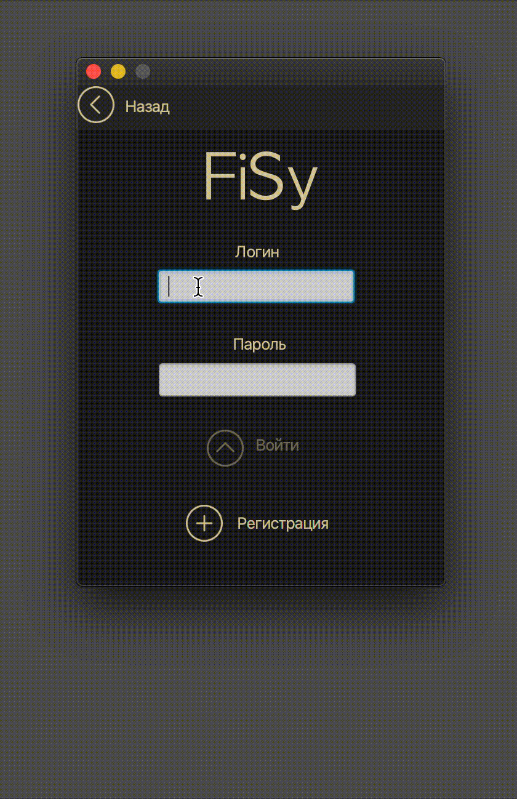

# FiSy
Дипломная работа (файловый сервер)

## Программа является шифрованным файловым сервером с разграничением прав пользователей.

При разработке стояла цель разработать файловый сервер для учебных заведений, чтобы преподаватель мог иметь доступ к файлам учеников.

Соединение между клиентом и сервером является зашифрованным по алгоритму AES-256, HandShake(рукопожатие, обмен ключами шифрования трафика) производится при помощи алгоритма Диффи Хелмана.

Пароль передается по шифрованному каналу с использованием соли пароля, что-бы в базе данных сервера, даже одинаковые пароли в шифрованном виде выглядели по разному, и для дополнительной безопасности, что-бы при каждой авторизации пользователя пароль передавался не в однообразном виде.

На сервере все хранится в зашифрованном виде, каждая папка пользователя на стороне сервера хранится в виде UUID, что-бы невозможно было выяснить, чья именно это папка.

Все файлы в папке пользователся хранятся в одной куче, без ирерахии папок с названием в виде UUID, опять же, для невозможности определения типа хранящейся информации.

Все файлы зашифрованны при помощи AES-256.

Абсолютно вся база является зашифрованной, без пароля пользователя не имеется возможности определить, какая информация и что именно там хранится.

Для разграничения прав, для того, чтобы преподаватель имел доступ к файлам ученика, администратор оставляет запрос на стороне сервера к доступу определенного предопдавателя, к определенному ученику.

После авторизации ученика в системе, при помощи RSA 4086, пароль от базы данных ученика шифруется публичным ключом преподавалеля и сохраняется в базе преподвателя.

При следующей авторизации преподавателя, при помощи его уникального пароля, дешифруется его приватный ключ RSA, при помощи которого, дешифруется пароль базы данных ученика, после чего преподаватель имеет доступ к файлсам ученика.

### Окно поиска сервера

### Окно регистрации

### Окно логина

Запрет на ввод спец-символов

Ошибка, при вводе неправильного логина или пароля

### Авторизация

### Меню администратора на выдачу прав

### Загрузка файлов на сервер

### Обзор загруженных файлов на стороне сервера внутри клиента

### Выгрузка файлов с сервера

### Удаление файлов с сервера и деавторизация

## Сервер

### Окно сервера

### Вид папки пользователя на сервере

### Вид файлов пользователся на сервере

